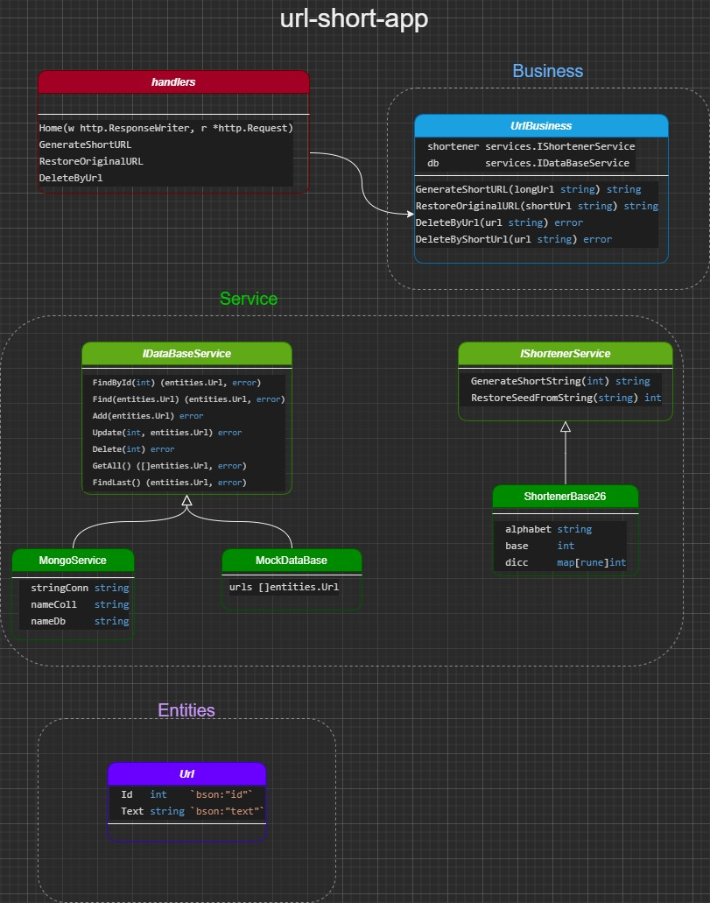

# url-short-app
Se quiere dotar al equipo de marketing de herramientas para poder hacer comunicaciones por canales de mensajería como SMS o Twitter. En estos canales, es muy importante que las comunicaciones sean cortas, así que es necesario desarrollar un acortador de URL.

## API
La api se encuentra hosteada en Heroku:
https://uapp-pr.herokuapp.com/

### Metodos
* GenerateShortUrl  ```POST ```
    * JSON(string) ->   JSON({UrlGen: string})
* RestoreUrl         ```GET```
    *  JSON(string) ->   JSON({Url: string})
* DeleteUrl       ```DELETE```
    *  JSON({Url:string, ShortURL: string})

## El proyecto
* API hecha en GO y MongoDB
* Comformado por dos ramas (master, dev)
* Cada uno configurado con Integracion Continua en la pestania "Action"
* Enfoque TDD
* Delivery Continuo mendiante Heroku con dos instacias QA y PR
* Se dispone de un deploy extra por pull request para realizar testing cruzado

## Diagrama de clase



## Un Diagrama de secuencia


